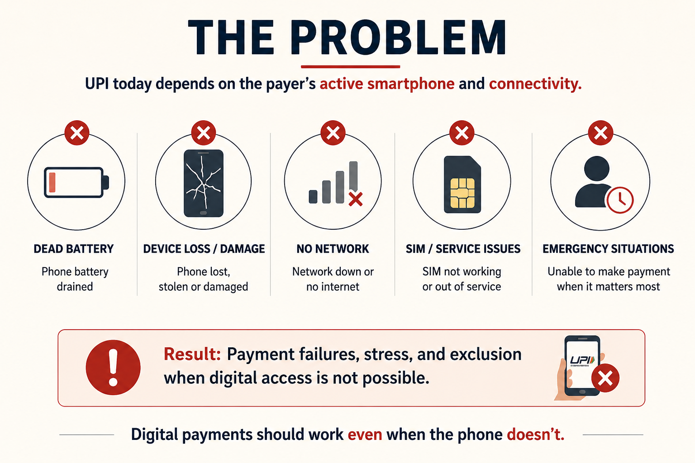
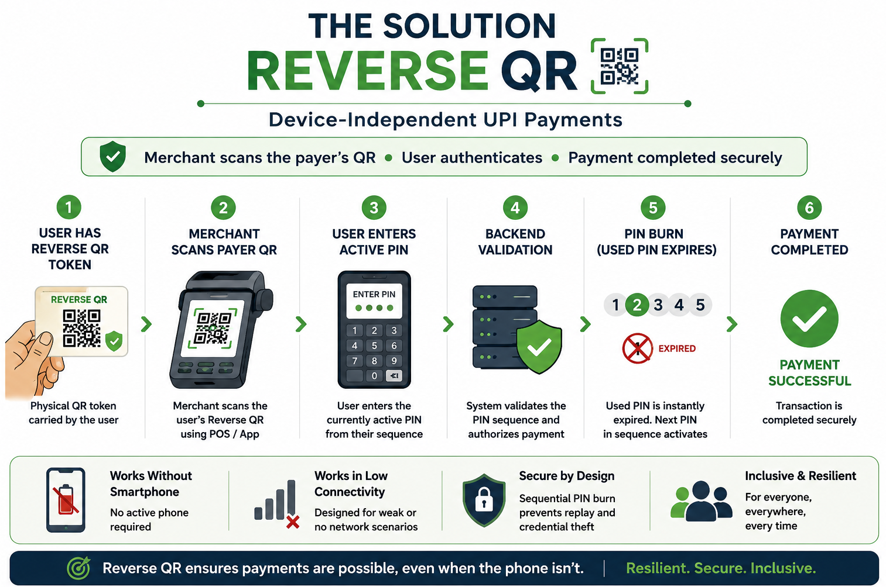

# Reverse QR: Device-Independent UPI  
A Resilience Layer for India’s Digital Payment Infrastructure  

---

## Executive Summary

India’s UPI ecosystem has transformed digital payments at population scale. However, the current payment architecture continues to depend heavily on the payer possessing:

- An active smartphone  
- Stable network connectivity  
- Sufficient battery availability  
- Continuous physical access to the device  

---

## Core Idea

Reverse QR proposes a device-independent payment initiation model where the merchant scans the payer’s secure physical QR token, reversing the conventional UPI transaction flow.

 Existing Flow
> Merchant displays QR → Payer scans using smartphone  

Proposed Reverse QR Flow
> Payer presents secure QR token → Merchant scans → User authenticates securely  

As digital payments increasingly become foundational public infrastructure, payment continuity during temporary device disruption becomes an important resilience consideration.

---

## Proposed User Flow

1. User securely provisions a Reverse QR token through their UPI application.  

2. User pre-configures a sequential set of authentication PINs.  

3. During payment, the merchant scans the payer’s physical QR token.  

4. User enters the currently active PIN for authorization.  

5. Backend systems validate the transaction and instantly expire the used PIN.  

6. Payment completes securely without requiring the payer’s active smartphone.  

---

## Prototype

🔗 Prototype Link: https://raguram-n.github.io/Reverse_QR/

---

## Key Innovation: Sequential PIN Burn Mechanism

One of the primary challenges in device-independent payments is mitigating credential theft and replay attacks on third-party merchant devices. To address this, Reverse QR introduces

> “Sequential PIN Burn Architecture”

### Mechanism

- User configures multiple unique PINs in sequence  
- Each PIN becomes invalid immediately after one successful transaction  
- Previously used credentials cannot be reused  
- Even if a merchant device logs the entered PIN, it becomes unusable after authorization  

---

## Security Benefits

The proposed model introduces multiple security advantages:

- Replay attack resistance  
- Reduced credential persistence risk  
- One-time transaction authorization logic  
- Physical QR contains no direct financial secrets  
- Stolen QR token alone cannot authorize payments  

---

## Strategic Relevance

Reverse QR explores a resilience-oriented payment architecture aligned with broader national priorities around:

- Digital financial inclusion  
- Payment continuity infrastructure  
- Low-connectivity transaction environments  
- Emergency transaction capability  
- Operational reliability at scale  

The concept may also support future exploration around:

- Rural payment continuity  
- Assisted transaction ecosystems  
- Disaster and emergency payment scenarios  
- Infrastructure redundancy models  

---

## Why This Matters

India’s digital public infrastructure has achieved global scale through simplicity, interoperability, and accessibility.

The next phase of innovation may involve designing systems that continue functioning even when the user’s primary device becomes temporarily unavailable.

Reverse QR attempts to address an important infrastructure question:

> “Can digital payments remain accessible even when the payer temporarily loses access to their smartphone?”

---

## Closing Note

This proposal is intended as an exploratory innovation concept focused on strengthening payment resilience and device-independent transaction continuity within India’s evolving digital finance ecosystem.

The intent is not to replace existing UPI authentication frameworks, but to explore how continuity-oriented fallback mechanisms may complement India’s digital payment infrastructure in constrained real-world conditions.

---

## Vision Statement

Reverse QR is built around a simple infrastructure principle:

> Digital payments should remain accessible even when the primary device becomes unavailable.

The proposal explores how resilience-oriented payment architecture can strengthen the future reliability of India’s digital public infrastructure.
